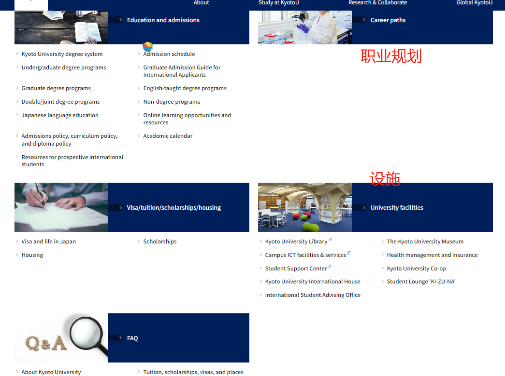
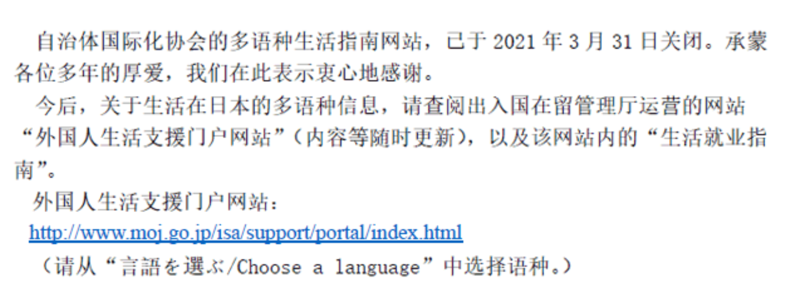

# 京都大学相关资讯

[Programs, admission information, visa requirements, and financial aid.](https://www.kyoto-u.ac.jp/en/education-campus)

[Tuition, scholarships, visas, and places to live](https://www.kyoto-u.ac.jp/en/education-campus/faq/2-2)

:::{figure-md} markdown-fig

官网信息、设施、faq等
:::

## 1. How much are the application, admission, and tuition fees?

Examination fees, which are required when submitting university entrance applications, are JPY17,000 for undergraduates and JPY30,000 for graduate students. Admission fees, to be paid as part of entrance formalities, amount to JPY282,000. Tuition is JPY535,800 per year (JPY804,000 per year for Law School students). For research students, entrance fees amount to JPY84,600, and monthly tuition is JPY29,700.

Examination fees for graduate students may be reduced to JPY10,000 for those who are screened based on submitted materials etc with no written examination. Please visit the following page for details.

提交大学入学申请时需要缴纳的考试费为本科生17,000日元，研究生30,000日元。作为入场手续的一部分，入场费为282,000日元。学费为每年535,800日元（法学院学生每年804,000日元）。研究生的入学费为84,600日元，每月学费为29,700日元。

研究生的考试费可以减免至10,000日元，如果根据提交的材料等进行筛选，没有笔试。详情请浏览以下页面。

## 2. What kinds of scholarships are available?

Available scholarships include the Japanese Government (Monbukagaskusho: MEXT) Scholarship, the Monbukagakusho Honors Scholarship for Privately Financed International Students, the Student Exchange Support Program (Scholarship for Short-Term Study in Japan), and those offered by foreign governments and private foundations. Please note, however, that the selection processes are highly competitive, and in most cases applications are accepted only after entrance to the University. It is therefore generally necessary to have sufficient financial resources prior to matriculation. Please visit the following page for further information.

- [Scholarships](https://www.kyoto-u.ac.jp/en/education-campus/procedures/scholarships)
- 可用的奖学金包括日本政府（文部科学省：文部科学省）奖学金、文部学所自费留学生荣誉奖学金、学生交流支持计划（日本短期学习奖学金）以及外国政府和私人基金会提供的奖学金。但请注意，选拔过程竞争激烈，在大多数情况下，只有在进入大学后才能接受申请。因此，在入学之前，通常有必要有足够的财务资源。请访问以下页面了解更多信息。

## 3. Are there other financial aid opportunities aside from scholarships?

Regular (degree-seeking) undergraduate and graduate students with excellent academic records experiencing financial difficulty may be eligible for a full or half tuition waiver. The waiver is granted to only a limited number of students, however, so the selection process is very competitive. Please ensure that you have sufficient financial resources before coming to Kyoto University. Visit the following page for details.

- [Tuition](https://www.kyoto-u.ac.jp/en/current/how-to/tuition)

普通(攻读学位)本科生和研究生，学习成绩优秀，遇到经济困难，可能有资格获得全额或一半学费减免。然而，豁免只授予有限数量的学生，因此选拔过程竞争非常激烈。请确保您在来京都大学之前有足够的经济资源。请访问以下页面了解详情。

## 4. Can I stay in University dormitories?

Kyoto University has seven residential facilities for international students and researchers: Kyoto University International Houses, located in Shugakuin, **Yoshida**, Uji, Ohbaku, Misasagi, Hyakumanben, and Okazaki. For international students to be eligible for residency, they must be expecting to enroll within a year of their arrival in Japan. 

租用期：

The tenancy(租用) period is either **one year or six months** (non-extendable in either case). 

住入及申请时间：

Move-in periods are in **April** and October, and applications are accepted through faculty/graduate school offices in **January and July (three months prior to move-in)** following admission to the University.

In addition, near Yoshida Campus there are three general student dormitories, which are open to both domestic and international students. The application periods and procedures vary by facility. Visit the following pages for details.

- [Kyoto University International Service Office: Kyoto University Lodging Facilities ](https://kuiso.oc.kyoto-u.ac.jp/housing/facilities/en)
- [学生寄宿舎 ](https://www.kyoto-u.ac.jp/ja/education-campus/campuslife/Life#gakuseikisyukusya)(in Japanese)

## 住宿：

京都留学生服务网站

[Kyoto University Lodging Facilities and International House](https://kuiso.oc.kyoto-u.ac.jp/en/housing/facilities/)

## 5. Does the University help students find apartments?

Kyoto University recommends that international students go to the Kyoto University CO-OP or real estate agencies after arriving in Japan. Apartment hunting is also possible online, such as via the following pages.

- [Kyoto University CO-OP 「住まい探し」 (in Japanese) ](https://www.s-coop.net/service/life/looking/)
- [Kyoto City International Foundation "HOUSE navi" ](http://housenavi-jpm.com/en/)

京都大学建议留学生在抵达日本后前往京都大学合作社或房地产中介机构。也可以在线寻找公寓，例如通过以下页面。

## 6. My apartment lease agreement says I need a guarantor. Can the University be my guarantor?

Effective 1 February 2017, Kyoto University is no longer available to act as a joint guarantor for housing lease agreements. Those having difficulty finding a joint guarantor are advised to ask a real estate agency whether it can help them find a private guaranty company. Listed below are companies offering discounted guarantor services to KyotoU international students regardless of their visa status.

自2017年2月1日起，京都大学不再作为房屋租赁协议的共同担保人。建议那些难以找到共同担保人的人询问房地产中介是否可以帮助他们找到私人担保公司。下面列出了为京都大学留学生提供折扣担保服务的公司，无论其签证状态如何。

- Global Trust Networks Co, Ltd
- Flat Agency
- "Green Guarantee Company" (for properties managed by Choei Co, Ltd) 或由Choei Co管理的物业
- Zenhoren Co, Ltd (no English-speaking staff available)

Further details are available on the following page.

- [Kyoto University International Service Office: Apartment Lease Guarantor Service for Foreign Nationals ](https://kuiso.oc.kyoto-u.ac.jp/housing/guarantor_for_researchers/en)

## 7. Can I work part time?

International students are allowed to have a part-time job, provided that they obtain a Work Permit in advance from the immigration bureau. The terms are as follows.

1. The part-time job must not interfere with academic work.
2. The maximum hours of work for Student Visa holders is 28 hours per week (this may be extended during summers and other long vacations to allow up to 8 hours of work per day, within the confines of the legal 40-hour work week).
3. The job must not affect public order and morals (for example, sex-related industry employment is forbidden).

1、兼职不得干扰学业。

2. 学生签证持有人的最长工作时间为每周 28 小时（在夏季和其他长假期间，可以在法定每周 8 小时工作制的范围内延长工作时间，每天最多任务作 40 小时）。

3.该工作不得影响公共秩序和道德（例如，禁止与性有关的行业就业）。

Working without permission will incur a penalty.

- [Kyoto University International Service Office: Work Permit ](https://kuiso.oc.kyoto-u.ac.jp/visa/work_permit/en)

Foreign nationals who are resident in Japan with “Student,” “Cultural Activities,” or “Dependent” status of residence are not permitted to work. Only students who need supplemental income to pay for their education and living expenses will be granted a permit to engage in part-time work (officially titled “Permission to engage in activity other than that permitted under the status of residence previously granted”). Those who work without obtaining this permit will be subject to punishment, and possible deportation from Japan. **Please be sure to obtain the permit before engaging in any work.**
The permit is also required by students who receive compensation from the university for a period of work. However, a permit is not necessary for teaching assistants (TA) or research assistants (RA) who work to support the university’s education and research activities, and for tutors to support new international students in Kyoto University.

Required Documents

- [Application Form (issued by the Immigration Bureau) ](https://www.moj.go.jp/isa/applications/procedures/16-8.html)
- Passport
- Residence Card

## 8. Who should I consult with about studying at Kyoto University?

Questions regarding application qualifications and entrance exams should be directed to the faculty or graduate school concerned. For other questions, please contact the International Education and Student Mobility Division.

- [Administrative offices of Graduate Schools and Faculties](https://www.kyoto-u.ac.jp/en/education-campus/inquiry)
- [Kyoto University International Undergraduate Program (Kyoto iUP)](https://www.iup.kyoto-u.ac.jp/contact/)

Questions regarding scholarships: 

- International Student Division
  Email: intlstudent*mail2.adm.kyoto-u.ac.jp (replace * with @)

Questions regarding student exchange programs: 

- International Education and Student Mobility Division
  Email: inbound.exchange*mail2.adm.kyoto-u.ac.jp (replace * with @)

If you are not sure about which office to contact for your question about studying at Kyoto University, please email:

- Study@Kyoto University Team
  Email: studyku*mail2.adm.kyoto-u.ac.jp (replace * with @)

## 9. After entering the University, can I consult with someone about studies, research, and daily life?

In certain cases, international students can receive tutoring from graduate student advisors (tutoring system). The University also offers consultation via the International Student Advising Office. There are off-campus consultation services as well. Visit the following pages and websites for details.

- [Tutor system](https://www.kyoto-u.ac.jp/en/current/campus-life/tutor-system)
- [International Student Advising Office](https://www.kyoto-u.ac.jp/en/education-campus/facilities/international-student-advising)
- [Kyoto City International Foundation: Consultation/Support ](https://www.kcif.or.jp/web/en/support/)
- [Kyoto Prefectural International Center: "Living Consultation for foreign residents" ](https://www.kpic.or.jp/english/information/livingconsultation.html)

## 10. Please tell me about the tutor system for international students.

The tutor system offers assistance to regular (degree-seeking) and certain categories of non-regular (non-degree seeking) international students, based on recommendations from their supervisors. Tutors are generally graduate students working in the same field of study as the international students requiring help. For details, please inquire at the relevant administrative office after matriculation.

- [Tutor system](https://www.kyoto-u.ac.jp/en/current/campus-life/tutor-system)

## 11. Does the University have any student clubs?

There are nearly 200 active cultural and athletic student clubs and circles on and off campus, covering practically every conceivable sport, hobby, and field of interest. International students may join clubs that suit their interests, but exchange and other non-regular (non-degree seeking) students, who attend Kyoto University for only a limited time, may not be able to join some of the activities. Please refer to the following page to learn about university-recognized clubs and circles.

- [Extracurricular activities](https://www.kyoto-u.ac.jp/en/current/campus-life/extracurricular-activities)

## 12. I have already passed the entrance examination and intend to attend the University. How do I obtain the required visa?

Successful candidates must obtain a Student Visa (Ryugaku) through a Japanese diplomatic mission in their country by presenting a **certificate or notification of acceptance** from Kyoto University, a valid passport, and other required documents. You may also need to submit evidence that you have sufficient funds to support yourself during your stay in Japan.

Those already in Japan with a resident status other than Student (Ryugaku) must change their status (for example, from Temporary Visitor [Tankitaizai]) to Student.

A Student status is required for applying for scholarships and for participating in international student events. Those without the status are advised to consult with their faculty/graduate school offices.

- [Visa and life in Japan](https://www.kyoto-u.ac.jp/en/education-campus/procedures/visa/)
- [Administrative offices of Graduate Schools and Faculties](https://www.kyoto-u.ac.jp/en/education-campus/inquiry/)

## 13. I need a Certificate of Eligibility to get a student visa. Can I expect the University to apply for one for me?

Kyoto University will apply for Certificates of Eligibility for **international students and their family members** upon request from the **faculty/graduate school offices** concerned, provided that the students have already passed the entrance examination and intend to attend the University. For further information, please inquire at the appropriate administrative office.

- [Kyoto University International Service Office: Applying for a Certificate of Eligibility through the Online Application System (Kyoto University Intranet) ](https://kuiso.oc.kyoto-u.ac.jp/visa/proxy/en)
- [Administrative offices of Graduate Schools and Faculties](https://www.kyoto-u.ac.jp/en/education-campus/inquiry/)

[关于资格与签证～取得签证的流程～](https://kuiso.oc.kyoto-u.ac.jp/en/before_arriving/aboutvisa/)

It usually takes approximately **one month** for the certificate to be issued after application. Please also note that the certificate will **expire three months** after the date of issue.

## 14. Can international students participate in outbound exchange programs?

It is possible for international students to participate in an exchange program, subject to approval from the partner university. Caution is advised for scholarship recipients, however, as they may lose their eligibility during the exchange period or be required to withdraw from the scholarship program.

- [海外 留学を希望する京大生へ ](https://www.kyoto-u.ac.jp/ja/education-campus/student-3)（in Japanese）
- [Scholarships](https://www.kyoto-u.ac.jp/en/education-campus/procedures/scholarships)

国际学生可以参加交换项目，但需得到合作大学的批准。但是，建议奖学金获得者谨慎，因为他们可能在交换期间失去资格或被要求退出奖学金计划。

## 15. I would like to work in Japan after graduation. What kind of support is available from the University?

Students seeking employment in Japan may learn the Japanese language and business etiquette through classes offered by the Education Center for Japanese Language and Culture of the Institute for Liberal Arts and Sciences (ILAS).

The General Student Support Center's Career Support Office offers information and consultation to all students, both domestic and international, who are in need of career and job search support.

Please visit the following pages for details.

- [Japanese language education](https://www.kyoto-u.ac.jp/en/current/japanese-language-education/)
- [Kyoto University General Student Support Center Career Support Office ](http://www.gssc.kyoto-u.ac.jp/career/en/about-us/)

在日本找工作的学生可以通过文理学院日本语言文化教育中心提供的课程学习日语和商务礼仪。总学生支持中心的职业支持办公室为所有需要职业和求职支持的国内外学生提供信息和咨询。

## 有关于租房子的基础知识・关于外国人的住宅租赁担保人

## ***1.观察好各大银行的汇率，选择最优汇率兑换***

## 兑换日元：

兑换当天之前先看几家银行的**日元汇率**，日元**汇率浮动**每天虽然不一样，但是相近天数之间**汇率是几乎持平**的，即使有轻微的浮动，但金额不大的情况下损失也是可以忽略的，金额大的话可能损失就会多一点点了，所以选好去银行**兑换日元的日期**，得到**当日最佳汇率**信息。

在兑换日元之前需要提前给你要兑换日元的银行**打电话预约**，因为有些**地方性的小银行**可能外币**资金有限**当天不能够提供给你需要的日元现金额度。

一般到了银行办理兑换业务的时候，需要**填写申请表**，其中有一项是填写兑换目的的，就是你兑换日元的**目的是什么**，大家可以如实填写，不清楚的可以直接填写**旅游或者留学**。

注意，中国海关规定，每人可以携带不超过**2万元人民币**或**5000美元**的等值外币出境。

现钞买入价是指银行或兑换机构愿意用本国货币购买外国货币的价格。 （银行->我 人民币 我->银行 日元

现钞卖出价"，表示金融机构愿意以现金卖出外汇的价格。 （银行->我 日元

现钞卖出价通常略高于现钞买入价，差价即为银行或兑换机构的汇差或利润。

具体来说，现汇买入价是银行或兑换机构愿意用本国货币购买外国货币（以电子方式）的价格。

现汇买入价通常会更接近实际的市场汇率，因为电子交易的方式更为便捷，涉及的手续费和成本相对较低。现汇买入价是投资者和企业进行国际贸易和投资时常用的汇率

在外汇市场中，还有与现汇买入价相关的"**现汇卖出价**"。现汇卖出价表示金融机构愿意以**电子方式卖出外汇的**价格，通常略低于现汇买入价。

2023.11.21

100日元 = 4.8257人民币

日本的生活费用会因个人的生活方式、所在城市、住房状况等因素而有所不同。以下是大致的一些基本费用的估算，但请注意这只是参考，具体费用会因个人情况而异：

1. **住房费用**：
   - 租金：租金在日本城市之间差异较大。在大城市如东京、大阪，租金可能较高。一室一厅的公寓租金可能在5万至15万日元之间，具体取决于地理位置和住宅条件。
   - 公寓管理费和水电费：这些费用会额外产生，具体取决于住房的类型和地点。
2. **食品费用**：
   - 食品价格因购买地点和个人口味而异。在超市购物相对便宜，外出就餐费用会有所增加。一个人每月的食品费用可能在3万至8万日元之间。
3. **交通费用**：
   - 公共交通：日本的公共交通系统非常发达，但费用会因使用频率和交通方式而异。通勤费用可能在1万至2万日元每月，但具体取决于通勤距离。
   - 汽油费：如果你拥有汽车，汽油费用将会成为额外开支。
4. **保险费用**：
   - 医疗保险：在日本，居民需要购买医疗保险。费用取决于收入和其他因素。
   - 住宅保险：租房或买房都可能需要购买住宅保险。
5. **通信费用**：
   - 移动电话和互联网费用：这些费用会根据使用的套餐和服务提供商而有所不同。
6. **日常开销**：
   - 衣物、个人护理品、娱乐等日常开销会根据个人的生活方式而有所不同。

奖学金：每月17万日元

**住房费用**：

- 租金：4-6万日元

**食品费用**：

**交通费用**：

**保险费用**：

**通信费用**：

**日常开销**：

衣物、个人护理品、娱乐等日常开销

:::{figure-md} markdown-fig

出入国在留管理厅
:::

汽车在日本的价格取决于多个因素，包括品牌、型号、车龄、配置和市场需求等。以下是一些对于新车和二手车的大致价格范围：

## 替换驾照：

如果你是在日本长期居住，且拥有外国驾照，通常在一段时间后你需要办理日本驾照。以下是一些可能的情况和相关信息：

1. **驾照替换期限**：
   - 根据日本法规，一般情况下，持有外国驾照的居民在入境后的1年内可以使用其原有的外国驾照。在这1年期限结束后，你需要在日本办理驾照替换手续。
2. **驾照替换申请**：
   - 你需要前往当地的交通局（Driver's License Center）或区公所（Ward Office）办理驾照替换手续。
   - 提供所需的文件，可能包括有效期内的外国驾照、护照、在日本居住的证明、身份照片等。
3. **驾照考试**：
   - 在申请替换时，有些地区可能要求你通过一些理论和实际驾驶考试，以确认你对日本的交通规则和驾驶环境的了解。
4. **替换费用**：
   - 替换驾照可能需要支付一定的费用，费用会因地区和具体情况而异。
5. **提供翻译文件**：
   - 有些地区可能要求你提供外国驾照的官方翻译件。你可以通过在原始文件上盖章或在交通局指定的机构办理。

请注意，具体的办理程序和要求可能会因地区而异，建议在开始办理之前，向当地的交通局或区公所咨询详细信息。如果你已经在日本超过1年，继续使用外国驾照可能会被视为违法，因此在期限内完成替换手续是很重要的。
